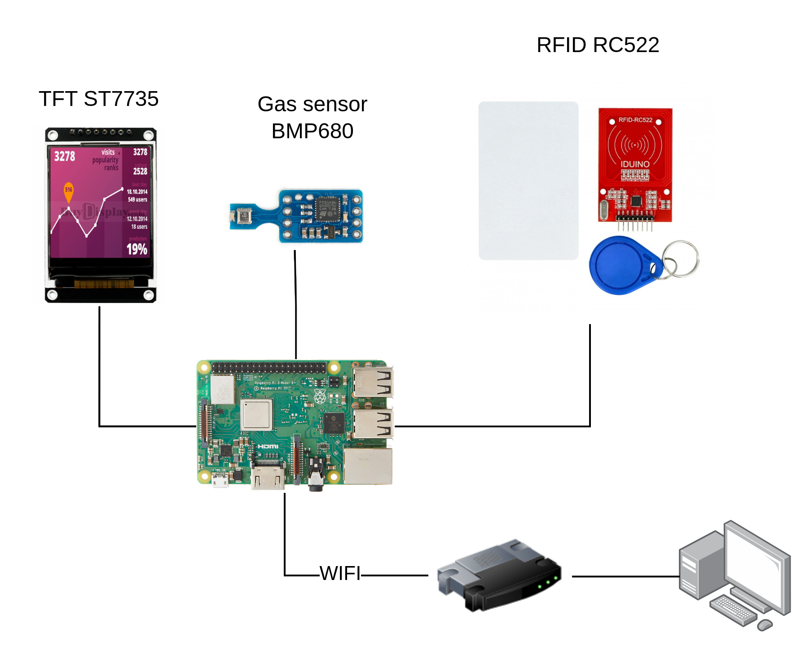

# Overview

Build a RFID system using raspberry pi 3B+



### Compiler
U-Boot: aarch64-linux-gnu-gcc


### Build

### Format SDC
**Two partition:**
* FAT32 (boot, linux kernel)
* EXT4 (rootfs)
```bash
./format_sd.h
```

### Build U-Boot
```bash
./build_uboot.sh
```

### Build buildroot
```bash
./build_buildroot.sh
```

